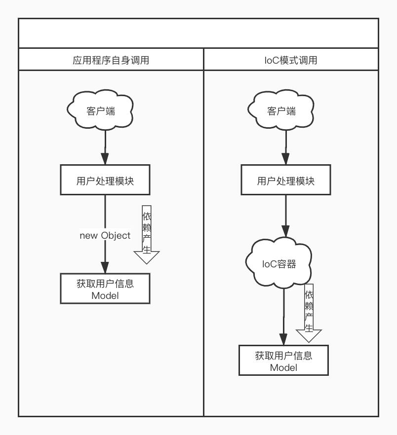
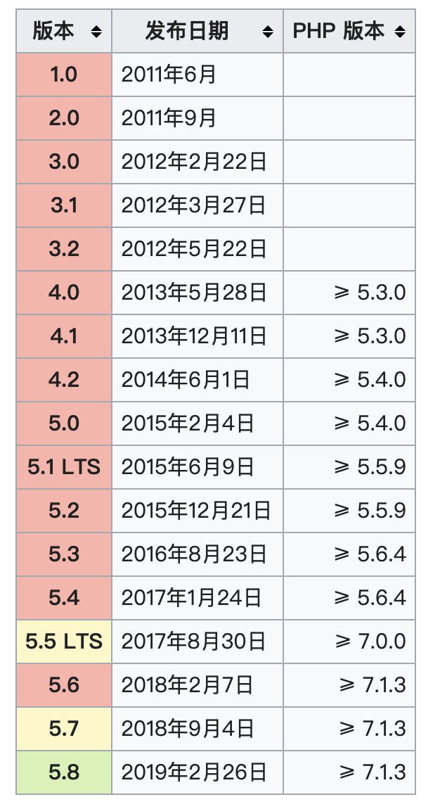
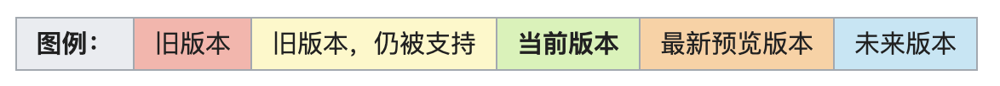

- [前言](#前言)

- [服务容器](#服务容器)
  - [1.什么是IoC](#1.什么是IoC)
  - [2.控制反转](#2.控制反转)
  - [3.依赖注入（DI）](#3.依赖注入（DI）)
  - [4.反射](#4.反射)
  - [5.再看IoC容器](#5.再看IoC容器)
  - [6.IoC容器代码](#6.IoC容器代码)
  - [参考文献](#参考文献)


## 前言

本文对将系统的对 Laravel 框架知识点进行总结，如果错误的还望指出

- 阅读书籍
  - 《Laravel框架关键技术解析》 陈昊 
- 学习课程
  - Laravel5.4快速开发简书网站 轩脉刃
  - Laravel重构企业级电商项目 檀梵


## 服务容器

### 1.什么是IoC

IOC 模式，不是一种技术，而是一种设计思想。在应用程序开发中，IoC 意味着将你设计好的对象交给容器控制，而不是传统的在你的对象内部直接控制，也是一种面向接口编程的思想。

当我们以面向接口编程的时候，程序中实例之间的耦合将上升到接口层次，而不是代码实现层次，使用配置文件来实现类的耦合。

容器的作用很简单，将在代码中使用像（new object）这样语法进行耦合的方式，改为配置文件来管理耦合，通过这种改变，从而保证系统重构或者业务逻辑改变时，不会发生“牵一发而动全身”的效果，从而有更好的可扩展性、可维护性。

总结：借助于“第三方”实现具有依赖关系的对象之间的解耦。

#### 举个栗子

在日常开发应用中，我们要实现一个功能，在`用户处理模块`中调用`获取用户信息Model`，通常是使用像（new object）这样的语法，在`用户处理模块`中将对象创造出来，这时代码依赖耦合就出现了，在`获取用户信息 Model`时则需要修改用户处理模块里的代码。

而调用 IoC 容器则将依赖耦合上升到接口层次，只需要修改容器注册时所绑定的服务即可。

<div align="center">
   
</div> 


其中涉及到 `依赖注入`、`控制反转`、`反射` 的思想


### 2.控制反转

控制反转是将组件间的依赖关系从程序内部提到外部容器来管理，那么就会出现，谁控制谁？反转是什么？有正转吗？

上述流程图中

1. 应用程序自身调用

   **用户处理模块** 创建了 **获取用户信息Model** ，那么  **用户处理模块** 控制了 **获取用户信息Model** ，这种创建过程称为 **正转**

2. IoC 模式调用

   **创建权** 交给了 IoC容器，由 Ioc 容器去创建 **获取用户信息Model** ，那么 Ioc 容器 控制了  **获取用户信息Model** ，这种创建过程称为 **反转**


正转：由程序本身在对象中主动控制去直接获取依赖对象

反转：由容器来帮忙建立及注入依赖对象


### 3.依赖注入（DI）

理解依赖注入我们需要先理解什么是依赖，再理解依赖注入

#### 依赖

在应用程序开发中由于某客户类依赖于某个服务类称为依赖

例：

```php
// 实现不同交通工具类
// 腿着
class Leg
{
    public function go()
    {
        echo 'walk to Tibet！！！';
    }
}

// 开车
class Car
{
    public function go()
    {
        echo 'drive car to Tibet！！！';
    }
}

// 列车
class Train
{
    public function go()
    {
        echo 'go to Tibet！！！';
    }
}

// 设计旅游者类，该类在实现游西藏的功能时要依赖交通工具类
class Traveller
{
    private $trafficTool;

    public function __construct()
    {
        $this->trafficTool = new Leg();
    }

    public function viisitTibet()
    {
        $this->trafficTool->go();
    }
}

$app = new Traveller();
$app->viisitTibet();
```

上述实例就是一个依赖的过程，当创建一个 Traveller 实例的时候，构造函数中获取了（new Object）其中一个交通工具服务类，这时依赖就产生了，客户类（Traveller）依赖于服务类（Leg），在实际开发中需求经常改动，那么如果直接修改客户类的代码就非常繁琐并且不利于维护。


#### 依赖注入

动态的向某个对象提供它所需要的其他对象，指组件的依赖通过外部以参数或其他形式注入，不在客户类里面用 （new object）的方式去实例化服务类而转由外部来负责，并且面向接口编程，将参数转为接口类，而不是具体的某个实现类，拓展性更强。

例：

```php
// 设计公共接口
interface Visit
{
    public function go();
}
// 实现不同交通工具类
// 腿着
class Leg implements Visit
{
    public function go()
    {
        echo 'walk to Tibet！！！';
    }
}
// 开车
class Car implements Visit
{
    public function go()
    {
        echo 'drive car to Tibet！！！';
    }
}
// 列车
class Train implements Visit
{
    public function go()
    {
        echo 'go to Tibet！！！';
    }
}
// 设计旅游者类，该类在实现游西藏的功能时要依赖交通工具类
class Traveller
{
    private $trafficTool;

    public function __construct( Visit $trafficTool)
    {
        $this->trafficTool = $trafficTool;
    }

    public function visitTibet()
    {
        $this->trafficTool->go();
    }
}

// 生成的交通工具依赖
$trafficTool = new Leg();
// 依赖注入的方式解决依赖问题
$app = new Traveller($trafficTool);
$app->visitTibet();
```

上述实例就是一个依赖注入的过程，当创建一个 Traveller 实例的时候，构造函数依赖一个外部的具有 Visit 接口的实例，我们传递一个 `Leg` 实例，即通过依赖注入的方式解决依赖问题。

这里要注意的是，依赖注入需要通过接口来限制，不能随意开放，这也体现了设计模式的另一个原则——针对接口编程，而不是针对实现编程。


### 4.反射

#### 什么是反射

PHP 反射机制是指在程序运行状态中，动态获取信息以及动态调用对象。

这种动态获取信息以及动态调用对象的方法的功能称为反射 API。

PHP 中获取实例的信息是通过 [Reflection](https://www.php.net/manual/zh/book.reflection.php) 实现

#### 反射作用

为什么要使用反射机制？直接创建（new）对象不就可以了吗？

先理解动态调用对象与静态调用对象的区别

##### 动态调用对象

通过类的路径或别名获取关于类、方法、属性、参数等详细信息，包括注释，就算类成员定义为 private 也可以在外部访问。

##### 静态调用对象

通过使用（new Object）的方式获取类的实例。

##### 代码灵活性

而编译性语言区别更为明显，静态调用对象在编译时确定实例的类型，绑定对象，动态调用对象则是在运行时确定实例的类型，提高了编译性语言的灵活性，降低类之间的耦合

##### 为什么要使用反射机制

这样就可以把调用一个实例的行为写成一个类的方法或者创建函数，然后统一接口调用创建函数来创建实例对象，有点像工厂方法模式+面向接口编程的思想，这个类的方法和创建函数则是 IoC 容器

##### 举个栗子

```php
<?php

class B
{

}

class A
{

    public function __construct(B $args)
    {
    }

    public function demo()
    {
        echo 'Hello world';
    }
}

//建立class A 的反射
$reflectionClass = new ReflectionClass('A');

$b = new B();

// 创建 class A 的实例
$instance = $reflectionClass->newInstanceArgs([$b]);
// 执行实例中的方法，输出 ‘Hellow World’
$instance->demo();
// 获取class A 的构造函数相关信息
$constructor = $reflectionClass->getConstructor();
/**
 * 获取class A 构造函数参数的相关信息
 * 参数数组
 */
$dependencies = $constructor->getParameters();
foreach ($dependencies as $dependencie) {
    var_dump($dependencie->getClass());
    die;
}
// 获取class A 的构造函数
var_dump($constructor);
// 获取class A 的构造函数相关信息
var_dump($dependencies);
```


###5.再看IoC容器

我们再来看一下 IoC 容器的概念在日常开发应用中，我们在A服务中调用B服务要实现一个功能，或者要调用一个对象时都要使用像（new object）这样的语法，将对象创造出来，这时你需要关心这个对象是什么，在哪里，如何创建，然后再创建，这时就出现了代码耦合，而IoC 容器就好比 ”大象放进冰箱，大象取进冰箱，需要几步“，需要三步

1. 把冰箱门打开 2. 把大象放进去 3. 把冰箱门关上
2. 把冰箱门打开 2. 把大象取出来 3. 把冰箱门关上

你不需要关心大象在哪，具体哪个大象，如何放进去，如何取出来，你只需要做到放和取这个动作就行了，这样就避免了代码耦合，而

放大象，则需要将大象放到或者注册到（bind）容器里

取大象，则需要将大象取出（make）就可以

服务容器可以理解为进阶版的工厂模式，更是一种面向接口编程的思想。

工厂模式的大量应用降低了代码重复量以及利用率，但是依然还需要调用者去定位工厂。

最理想的情况是，调用者无需关心调用者的实现，也无需定位工厂，而面向接口配置化。


### 6.IoC容器代码

来看一段 IoC 容器代码，下面这段代码对 Laravel 的设计方法进行了简化，不是 Laravel 的源码， 而是来自一本书《laravel 框架关键技术解析》，这段代码很好的还原了 laravel 的服务容器的核心思想，代码有点长，可以尝试运行调试一下，这样易于理解：

```php
// 设计容器类，容器类装实例或提供实例的回调函数
class Container
{
    // 容器绑定数组
    // 用于装提供实例的回调函数，真正的容器还会装实例等其他内容，从而实现单例等高级功能
    protected $bindings = [];

    // 绑定接口和生成生成相应实例的回调函数
    public function bind($abstract, $concrete = null, $shared = false)
    {
        if (!$concrete instanceof Closure) {
            // 如果提供的参数不是回调参数，则产生默认的回调函数
            $concrete = $this->getClosure($abstract, $concrete);
        }

        $this->bindings[$abstract] = compact('concrete', 'shared');
    }

    // 默认生成实例的回调函数
    public function getClosure($abstract, $concrete)
    {
        // 生成实例的回调函数，$c 一般为 IoC 容器对象，在调用回调生成实例时提供
        // 即 build 函数中的 $concrete($this)
        return function ($c) use ($abstract, $concrete) {
            $method = ($abstract == $concrete) ? 'build' : 'make';
            // 调用的是容器的 build 或 make 方法生成实例
            return $c->$method($concrete);
        };
    }

    // 生成实例对象，首先解决接口和要实例化类之间的依赖关系
    public function make($abstract)
    {
        $concrete = $this->getConcrete($abstract);
        if ($this->isBuildable($concrete, $abstract)) {
            $object = $this->build($concrete);
        } else {
            $object = $this->make($concrete);
        }

        return $object;
    }

    protected function isBuildable($concrete, $abstract)
    {
        return $concrete === $abstract || $concrete instanceof Closure;
    }

    // 获取绑定的回调函数
    protected function getConcrete($abstract)
    {
        if (!isset($this->bindings[$abstract])) {
            return $abstract;
        }
        return $this->bindings[$abstract]['concrete'];
    }

    // 实例化对象
    public function build($concrete)
    {
        if ($concrete instanceof Closure) {
            return $concrete($this);
        }
        // ReflectionClass 类报告了一个类的有关信息
        $reflector = new ReflectionClass($concrete);
        // 检查类是否可实例化 return bool|false
        if (!$reflector->isInstantiable()) {
            echo $message = "Target [$concrete] is not instantiable.";
        }
        // 获取类的构造函数
        $constructor = $reflector->getConstructor();
        if (is_null($constructor)) {
            return new $concrete;
        }

        // 获取类构造函数的参数
        $dependencies = $constructor->getParameters();
        $instances = $this->getDependencies($dependencies);
        return $reflector->newInstanceArgs($instances);
    }

    protected function getDependencies($parameters)
    {
        $dependencies = [];
        foreach ($parameters as $parameter) {
            $dependency = $parameter->getClass();
            if (is_null($dependency)) {
                $dependencies[] = null;
            } else {
                $dependencies[] = $this->resolveClass($parameter);
            }
        }
        return (array)$dependencies;
    }

    protected function resolveClass(ReflectionParameter $parameter)
    {
        return $this->make($parameter->getClass()->name);
    }
}
```

上面的代码就生成了一个容器，下面是如何使用容器

```php
// 实例化 IoC 容器
$app = new Container();
// 完成容器的填充
$app->bind("traveller", "Traveller");
$app->bind("Visit", "Train");

// 通过容器实现依赖注入，完成类的实例化
$tra = $app->make("traveller");
$tra->visitTibet();
$tra = $app->make("Visit");
$tra->go();
```

#### 代码解析

当实例化一个容器类（Container）后，向容器中填充服务

```php
$app->bind("traveller", "Traveller");
$app->bind("Visit", "Train");
```

绑定完成后，查看容器 `$bindings` 绑定的值

```json
array(2) {
  ["traveller"]=>
  array(2) {
    ["concrete"]=>
    object(Closure)#2 (3) {
      ["static"]=>
      array(2) {
        ["abstract"]=>
        string(9) "traveller"
        ["concrete"]=>
        string(9) "Traveller"
      }
      ["this"]=>
      object(Container)#1 (1) {
        ["bindings":protected]=>
        array(2) {
          ["traveller"]=>
          *RECURSION*
          ["Visit"]=>
          array(2) {
            ["concrete"]=>
            object(Closure)#3 (3) {
              ["static"]=>
              array(2) {
                ["abstract"]=>
                string(5) "Visit"
                ["concrete"]=>
                string(5) "Train"
              }
              ["this"]=>
              *RECURSION*
              ["parameter"]=>
              array(1) {
                ["$c"]=>
                string(10) "<required>"
              }
            }
            ["shared"]=>
            bool(false)
          }
        }
      }
      ["parameter"]=>
      array(1) {
        ["$c"]=>
        string(10) "<required>"
      }
    }
    ["shared"]=>
    bool(false)
  }
  ["Visit"]=>
  array(2) {
    ["concrete"]=>
    object(Closure)#3 (3) {
      ["static"]=>
      array(2) {
        ["abstract"]=>
        string(5) "Visit"
        ["concrete"]=>
        string(5) "Train"
      }
      ["this"]=>
      object(Container)#1 (1) {
        ["bindings":protected]=>
        array(2) {
          ["traveller"]=>
          array(2) {
            ["concrete"]=>
            object(Closure)#2 (3) {
              ["static"]=>
              array(2) {
                ["abstract"]=>
                string(9) "traveller"
                ["concrete"]=>
                string(9) "Traveller"
              }
              ["this"]=>
              *RECURSION*
              ["parameter"]=>
              array(1) {
                ["$c"]=>
                string(10) "<required>"
              }
            }
            ["shared"]=>
            bool(false)
          }
          ["Visit"]=>
          *RECURSION*
        }
      }
      ["parameter"]=>
      array(1) {
        ["$c"]=>
        string(10) "<required>"
      }
    }
    ["shared"]=>
    bool(false)
  }
}
```

当执行 `$tra = $app->make("traveller");` 时，程序就会用调用 make 方法，判断是否已经绑定实例，若已绑定好则调用 `build` 获取已经绑定好的闭包函数，开始解析，闭包函数在 `build` 方法中会执行 `return $concrete($this)` 将当前类作为参数为闭包函数传参，最终又会执行到 `build` 方法，类似于递归调用，最后执行的 `build` 方法中 `$concrete的值为字符串 Traveller`，通过反射获取 `class Traveller` 的类有关信息，再进行下一步

 `$reflector->isInstantiable() // 检查类是否可实例化 return bool|false`，

 `$reflector->getConstructor(); //获取类的构造函数`

`$constructor->getParameters(); // 获取类构造函数的参数`

再获取构造函数中每个参数是否含依赖，`$this->getDependencies($dependencies)`，这个方法知道了 `class Traveller`   含有依赖类 `Visit` ，我们要做的就是解决这个依赖

```php
// $dependency
object(ReflectionClass)#7 (1) {
  ["name"]=>
  string(5) "Visit"
}
```

通过 `getDependencies ($parameters)`  中的 `$parameter->getClass()`  获取到依赖类 `Visit`， 再调用 `resolveClass (ReflectionParameter $parameter)`  就会发现之前的为什么要 `bind` 接口类，而不用具体实现类的原因了，因为通过接口类的名称，在容易中获得实例，会获取到所对应的具体实现类，`$app->bind("Visit", "Train");`

最后我们通过 `return $reflector->newInstanceArgs($instances);`  获取到了 `Train` 的具体实现类。

```php
array(1) {
  [0]=>
  object(Train)#9 (0) {
  }
}
```

到这里 IoC 的流程就结束了，这就是其中控制反转、依赖注入，闭包，反射等概念的关系及应用。


## 课程结构


## 一、Laravel 5.4 介绍


### 1. Laravel的特性

`优雅`、`简洁`、`工程化`

- 优雅：

  使用了很多设计模式，依赖注入，中间件，门脸模式，易读性

- 简洁：

  封装了很多实用的方法，比如获取当前用户信息，则直接auth::user方法就可以

- 工程化：

  PHP生态重点内容，有人认为laravel非常重，但是正是这一特性，导致laravel框架达到了工程化的标准，互联网网站生态发展到现在已经不是一个文件两个文件可以就可以解决，往往需要多个文件，多个分层，好的项目架构，那么工程化是必不可少的路程

  

### 2. Laravel的历史版本

<div align="center">
   
   
  <br>图片来源：<a href="https://wc.yooooo.us/d2lraS9MYXJhdmVsIXpo">维基百科</a><br>
</div> 


### 描述：

- 1.0、2.0、3.0版本之间迭代时间很短，差不多几个月就迭代一个版本，说明这个时间Laravel还是很不稳定的，

- 4.0、5.0迭代的速度就以一年或两年才进行一次大的版本迭代，5.1版本较特殊，为LTS仍然被支持维护，如果有人对5.1进行提出意见和bug，就会进行修复


### 3. Laravel的优势

- Laravel的功能较为丰富
  - 队列

    支持多种队列驱动，数据库，redis，都可以支持，支持队列失败，重启，延迟等

  - 搜索

    搜索分页，搜索索引同步

  - 数据库迁移

    所有数据库创建，修改操作都可以在代码层操作，使用这个可以保证协作者开发中的字段同步，比如删了一个字段，协作者只需要执行一个脚本，就可以保持同步数据库结构

  - 定时脚本

    代码层进行管理修改定时任务

- Laravel使用了丰富的第三方包

  - [composer管理](https://www.phpcomposer.com/)

    现在很多PHP社区都已经支持composer包。合适使用包管理实战在巨人肩膀上进行开发，能更好的引入

    例：[数据填充包](https://github.com/fzaninotto/Faker/)

    测试编码格式问题，就需要引入各国语言的文字，而手动测试则会遗漏掉很多问题，这时候用现有的数据填充包去进行调试则很好解决了这个问题

- Laravel的思想更为先进

  服务容器及服务提供者，为最为核心的思想之一，也是代码层面的服务化，所有的项目用到的服务，是由服务提供者存放到容器中，当具体要使用什么服务时，直接从容器中使用就可以。

  这种思想的好处：

  ​	获取服务调用容器的人，是不需要考虑服务是谁提供的，这是一种解耦，在替换服务提供者方时就变的非常方便了，类似于工厂模式

  - 服务容器
  - 服务提供者

- Laravel的社区更为丰富

  - 国际化

    在Stack overFlow都会有很多讨论和教程，可以从上面获取到很多养分。

  - 基于Laravel的开源项目多

  - 开源

## 二、Laravel 5.4 安装

-  安装环境要求

  - PHP >= 5.6.4
  - PHP扩展
  - MySQl
  - Openssl PHP Extension
  - PDO PHP Extension
  - Mbstring PHP Extension
  - Tokenizer PHP Extension
  - XML PHP Extension

  ```shell
  # 查看PHP版本
  $ php -v
  # 查看已安装的PHP扩展包
  $ php -m
  ```

  

- Composer安装 

  - [如何安装 Composer](https://pkg.phpcomposer.com/#how-to-install-composer)

  - 创建Laravel项目

    ```shell
    $ composer create-project laravel/laravel laravel 54 "5.4.*"
    ```

    

- 启动laravel服务

  php artisan serve

-  Laravel目录结构

   ```shell
   app # 逻辑代码
   config # 配置文件
   database # 数据库管理，应用于数据迁移，数据填充
   public # 对外可见资源
   resources # 模版文件 mvc层中的view
   routes # 路由文件
   storage # 日志缓存信息
   tests # 测试用例文件，单元测试、集成测试
   vendor # 第三方包扩展文件夹
   
   注意：启动laravel项目时，启动的用户要保证和storage用户一致，也就是要保证文件夹有读写权限
   ```

   

- 配置文件说明和更改

  - databases.php `数据库配置参数文件`

    `default` 参数表示当前数据库连接默认使用某种连接方式，具体连接方式在 `connections` 参数中配置


## 三、实际开发总结

### 1. 文章模块

- 路由

  

- 模版

- 表设计

- 模型

- 页面逻辑

  - 文章列表
  - 添加文章
  - 编辑文章
  - 删除文章
  - 文章详情