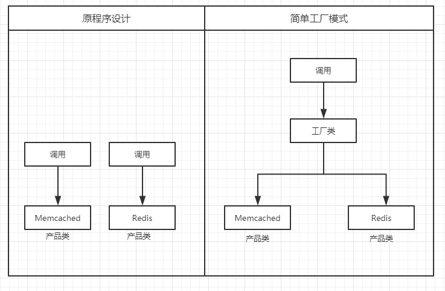
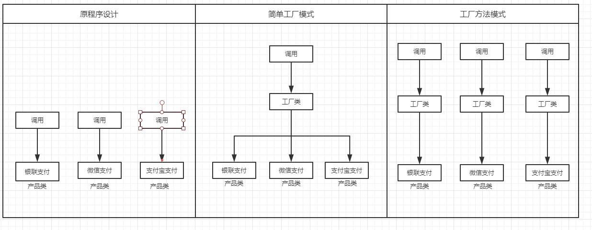

- [前言](#前言)
- [什么是设计模式](#什么是设计模式)
- [设计模式的原则](#设计模式的原则)
- [设计模式](#设计模式)
  - [简单工厂模式](#简单工厂模式)
  - [工厂方法模式](#工厂方法模式)
  - [抽象工厂模式](#抽象工厂模式)
- [参考文献](#参考文献)


## 前言

最近再看PHP设计模式相关的一些技术文章，网上有关PHP的设计模式范例很少，这里做一些总结仅供参考，不足之处望提出。

- 阅读书籍
  - 《大话设计模式》程杰


## 什么是设计模式

设计模式是一套被反复使用、多数人知晓的、经过分类的、代码设计经验的总结。

基于面向对象的三大特性封装、继承、多态为标准的程序代码设计。

 

## 设计模式的原则

1. 单一指责：一个类，只需要做好一件事情。
2. 开放封闭：一个类，应该是可扩展的，而不可修改的。
3. 依赖倒置：一个类，不应该强依赖另外一个类。每个类对于另外一个类都是可替换的
4. 配置话：尽可能地使用配置，而不是硬编码
5. 面向接口编程：只需要关心接口，不需要关心实现。

之后的讲解会围绕这几点。


## 简单工厂模式

### 概述

简单工厂模式是由一个工厂类决定创建出哪一种产品类的实例，其中有两个关键字，工厂类、产品类。

下面举个例子解释这两个关键词。

### 举个栗子　

#### 问题

程序代码中应用缓存，暂时考虑用Memcached，之后可能会换Redis，程序如何设计。

假设程序设计使用Memcached，每一次的代码肯定是 new Memcaced ； 如果因为项目扩展要更换为Redis，必然很多代码都要改。

#### 流程图如下

<div align="center">
   
</div> 

**产品类**：其中Memcached和Redis是产品类，暂时举例两个产品类，可能会有很多个。

**工厂类**：声明一个公共类，由该类指定使用哪个产品，这样就不需要改动【调用层】代码内容。

看到这个图是不是对关键词清晰很多了。

我们要做什么：

​	让 **「工厂公共类」** 来选择调用哪个具体产品

#### 程序设计代码

```php
<?php
  
// 工厂公共类
class Cache
{
    public static function cacheMode($type)
    {
        switch ($type) {
            case 'Redis':
                return new RedisMode();
                break;
            case 'Memca';
                return new MemcachedMode();
                break;
            default:
                return false;
                break;
        }
    }
}

// Redis 类
class RedisMode
{
    public function getName()
    {
        echo '我是Redis';
    }
}

// MemcachedMode 类
class MemcachedMode
{
    public function getName()
    {
        echo '我是Memcached';
    }
}

$mode = Cache::cacheMode('Redis'); // 工厂公共类
$mode->getName();
```


#### 总结

> 优点：

1. 一个调用者想创建一个对象，只要知道其名称就可以了。
2. 扩展性高，如果想增加一个产品，只要扩展一个工厂类就可以。
3. 屏蔽产品的具体实现，调用者只关心产品的接口。

> 缺点：

1. 每次增加一个产品时，都需要增加一个具体类和对象实现工厂，使得系统中类的个数成倍增加，在一定程度上增加了系统的复杂度，同时也增加了系统具体类的依赖。这并不是什么好事。

2. 违背了设计模式的原则【开放封闭】原则

3. 开放封闭：一个类，应该是可扩展的，而不可修改的。

  

  之后，工厂方法模式应运而生，请看 [工厂方法模式](#工厂方法模式)。


## 工厂方法模式

### 概述

工厂方法就是为了解决简单工厂扩展性的问题，相信大家再看简单工厂是也发现了其缺陷，

以前简单工厂要扩展的时候，需要修改工厂内容，这就违背了设计模式对外扩展开放，对内修改关闭原则，所以搞了个工厂方法模式，这是我的理解，
　　　 

> 涉及元素：

- 工厂类（实例化产品A）
- 工厂类（实例化产品B）
- 产品类A
- 产品类B


### 举个栗子　

#### 问题

一个商城网站，支持多种支付功能，例如：支付宝、微信、某银行、某银行……，程序如何设计。

如果按照简单工厂模式的话，声明一个工厂类，由工厂类判断调用哪种支付方式，那么必然存在工厂类不断修改的操作，每增加一个支付方式都要去修改工厂类，违背了【开放封闭】原则

解决的问题：

1. 解决简单工厂【开放封闭】原则问题　　　　　

#### 流程图如下

<div align="center">
   
</div> 


#### 程序设计代码

```php
<?php
  
/**
 * 工厂类接口
 * Interface PayFactoryInterface
 * @package factory_method
 */
interface PayFactoryInterface
{
    public function createMode();
}
 
/**
 * 支付宝产品类转工厂类
 * Class ZhiFuBaoFactory
 * @package factory_method
 */
class ZhiFuBaoFactory implements PayFactoryInterface
{
    public function createMode()
    {
        return new ZhiFuBao();
    }
}

/**
 * 微信产品类转为工厂类
 * Class WeiXinFactory
 * @package factory_method
 */
class WeiXinFactory implements PayFactoryInterface
{
    public function createMode()
    {
        return new WeiXin();
    }
}

/**
 * Interface PayInterface
 * 定义支付Api规范接口
 */
interface PayInterface
{
    /**
     * 发起扣款
     * @return mixed
     */
    public function doAction($param);
}

// 银联
class ZhiFuBao implements PayInterface
{
    public function doAction($param)
    {
        $name = $param['name'];
        $money = $param['money'];
        echo $name . '使用支付宝支付,支付金额' . $money;
    }
}

// 微信支付
class WeiXin implements PayInterface
{
    public function doAction($param)
    {
        $name = $param['name'];
        $money = $param['money'];
        echo $name . '使用微信支付,支付金额' . $money;
    }
}

// 张三支付
$param = [];
$param['name'] = '张三';
$param['money'] = 100;

$factory = new WeiXinFactory();
$mode = $factory->createMode(); // 使用工厂类获取产品类
$mode->doAction($param); // 执行产品类方法
```


#### 总结


## 参考文献

- 《大话设计模式》程杰